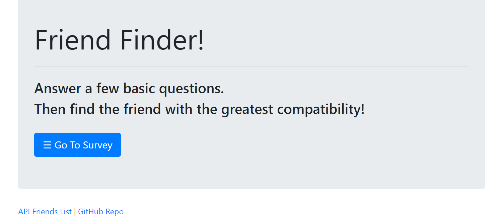
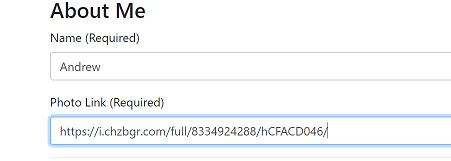
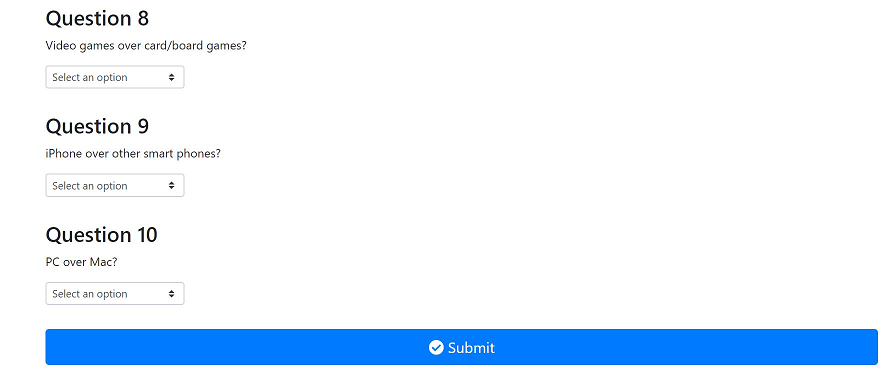

# Friend-Finder

## Title
Friend-Finder

## Description

This full-stack site which will take in a users result from a survey, then the app compares the users answers with those from other      users. The app will then display the name and picture of the user with the best overall match.

This full-stack site uses Heroku, GitHub, Node, Express, JQuery, JavaScript, HTML, and Bootstrap

Try it out here: https://desolate-stream-94607.herokuapp.com/

## Instructions

1. Click the survey button on the home page to bring you to the survey.
    

2. Fill in your name and a photo link (required).
    

3. Fill out the survey and click submit.
    

4. Find out who your best match is!
    
